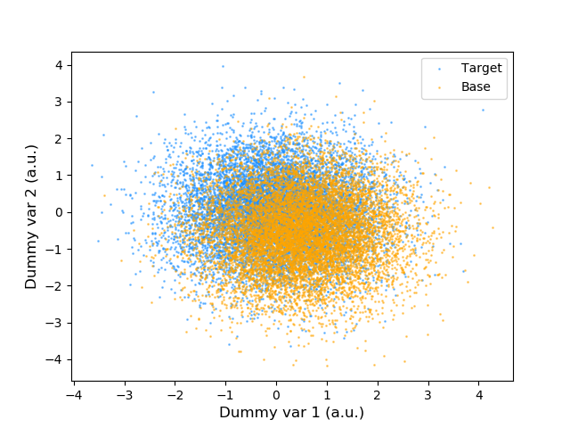

# Didactic implementation of BDT reweighting

### Introduction
Small tryout implementation of BDT reweighting.
See the references below for more information.

### Results
Dummy input data is generated as follows:

For this dummy data, the BDT reweighting method can accurately reweight the base to match the target, as shown below:

As a bonus, I found a typo in th original paper ([Rogoshnikov, 2016](https://arxiv.org/abs/1608.05806)): in paragraph 4, step (ii), the ratio should be reversed (otherwise the reweighting factors will push the base away from the target instead of towards it).

### References
- [Rogoshnikov, 2016](https://arxiv.org/abs/1608.05806)
- [CMS-HIG-20-005](http://dx.doi.org/10.1103/PhysRevLett.129.081802).
